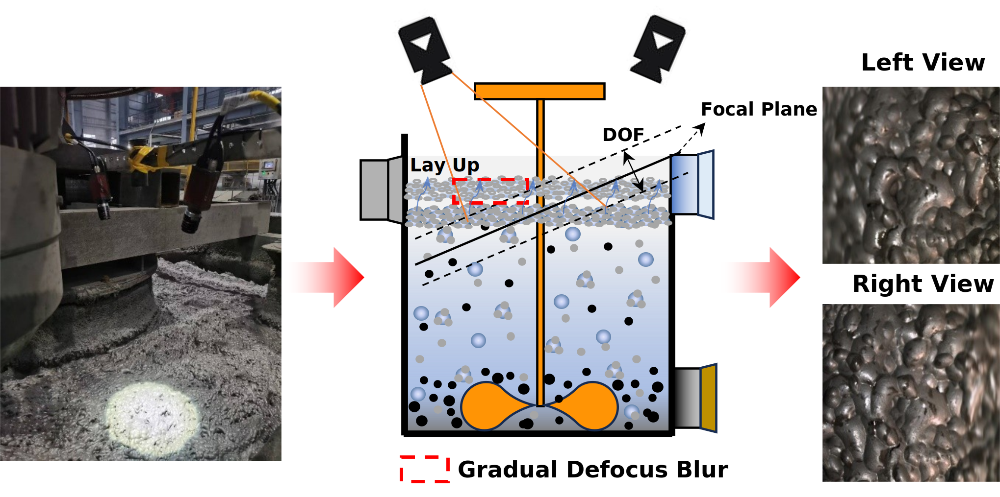
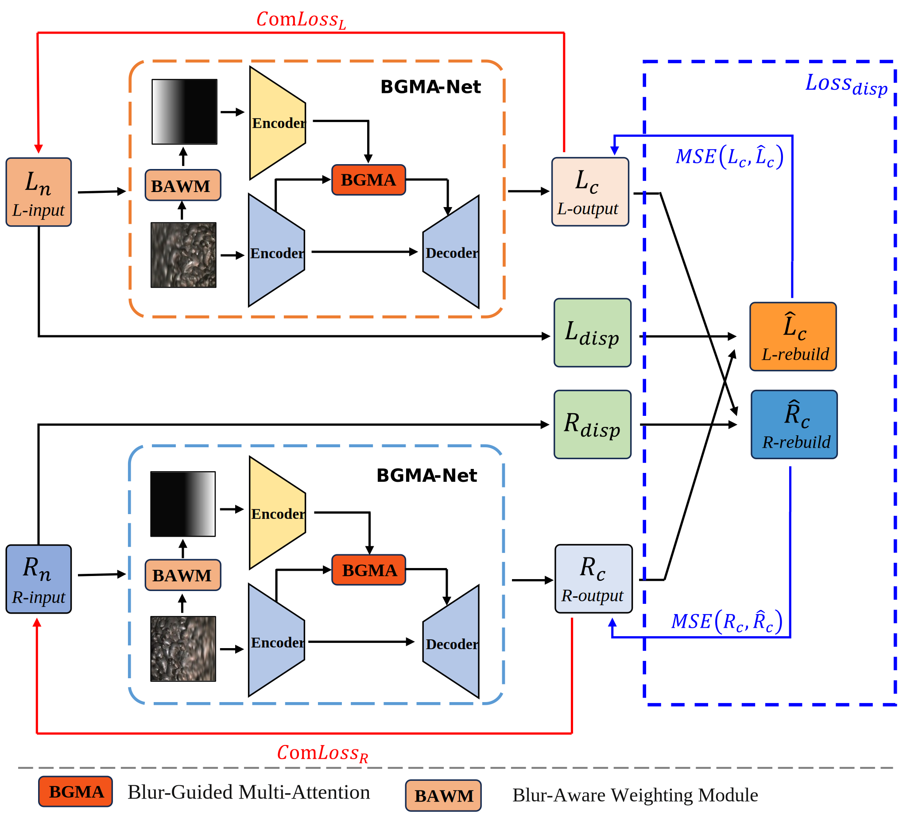
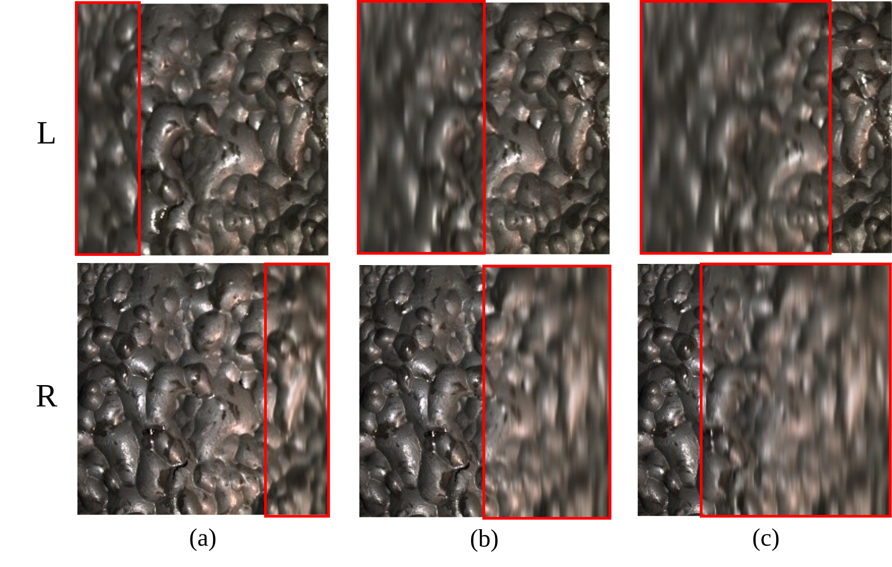
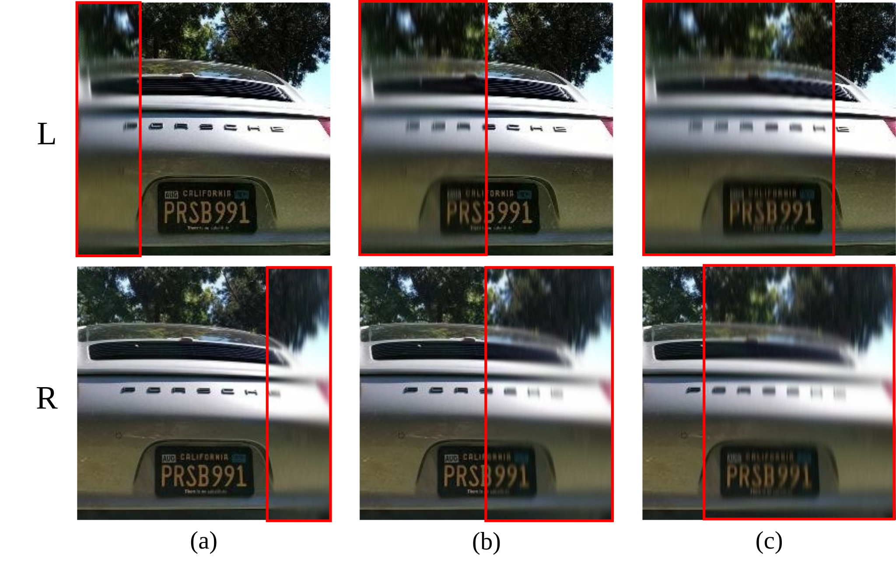
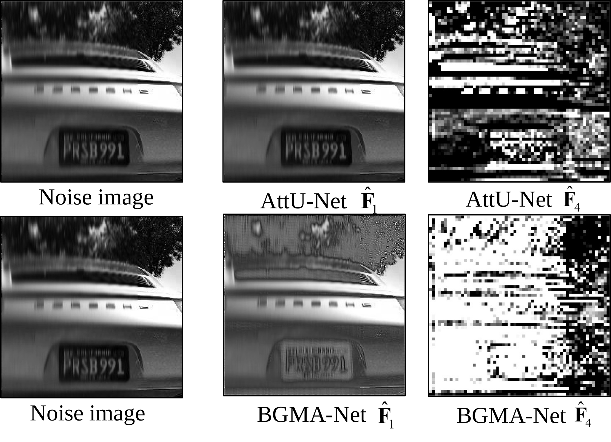
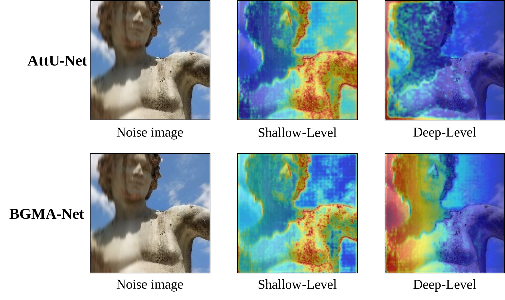
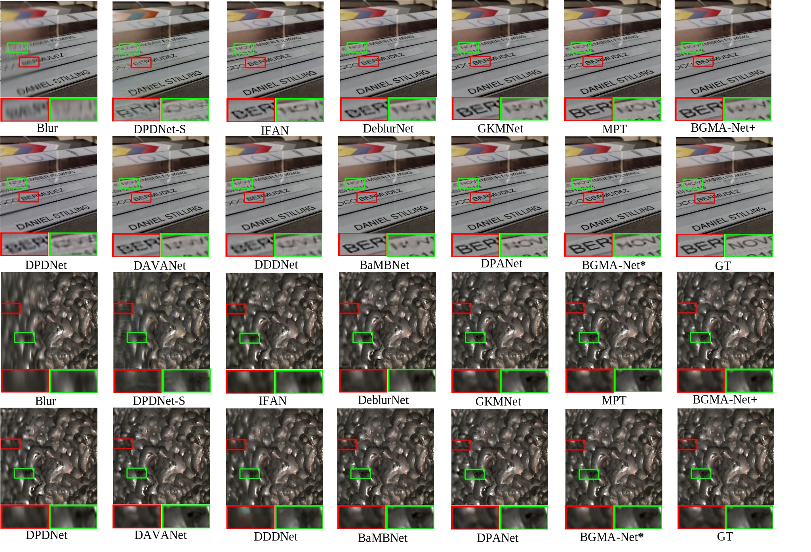
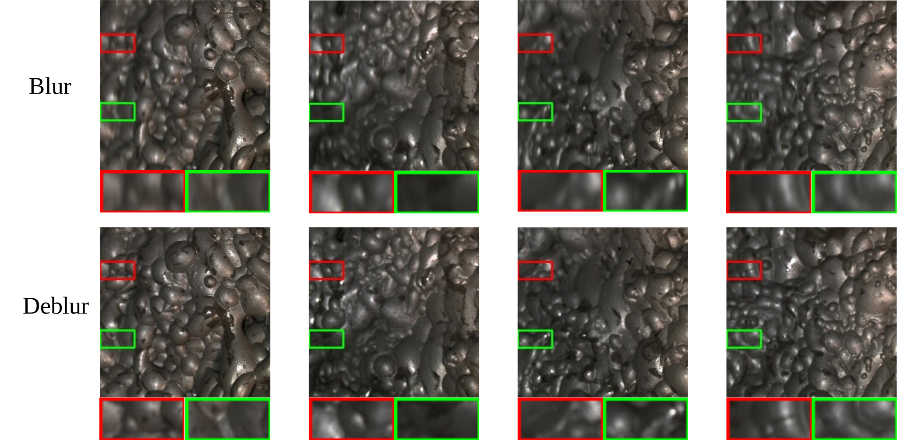
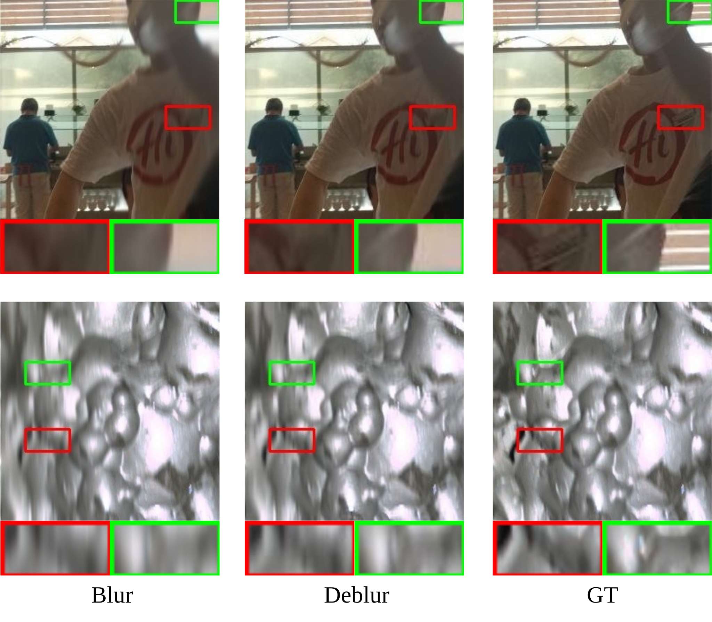

# BGMA-Net

<p align="center">
  <b>A Blur-Guided Multi-Attention Network Based on Left-Right Consistency for Gradual Defocus Deblurring in Binocular Images</b>
</p>

<p align="center">
  <a href="https://doi.org/10.1016/j.neucom.2025.131853"></a>
  <a href="https://www.sciencedirect.com/science/article/pii/S0925231225025251"></a>
  <a href="https://github.com/Zkichn/BGMA-Net"></a>
  
</p>

<p align="center">
  <a href="https://www.sciencedirect.com/science/article/pii/S0925231225025251">Paper</a> |
  <a href="#quick-start">Quick Start</a> |
  <a href="#experiments">Experiments</a> |
  <a href="#citation">Citation</a>
</p>

<p align="center">
  
</p>

Official PyTorch implementation of **BGMA-Net**, a blur-guided multi-attention network for gradual defocus deblurring in binocular froth images. BGMA-Net uses blur-aware weighting to localize degraded regions, blur-guided multi-attention to strengthen feature restoration, and a left-right consistency framework to exploit stereo correspondence during training.

## News

- **2026.01**: BGMA-Net appears in *Neurocomputing*, Volume 661, Article 131853.
- **2025.10**: Paper accepted by *Neurocomputing*.
- **Code release**: Core model modules are available. Training scripts, checkpoints, and dataset preparation utilities are being organized.

## Highlights

- **Blur-aware weighting module (BAWM)** estimates local blur severity from froth-image structure and provides explicit guidance maps.
- **Blur-guided multi-attention (BGMA)** combines spatial, channel, and local multi-head attention to focus restoration on severely blurred regions.
- **Left-right consistency (LRC)** leverages stereo geometry during training without adding inference overhead.
- **Industrial validation** shows strong generalization on naturally defocused flotation-froth imagery.

## Method

<p align="center">
  
</p>

BGMA-Net is built around three components:

1. **BAWM** generates blur weight maps by detecting blurred regions and estimating spatially varying blur severity.
2. **BGMA module** injects blur guidance into multi-scale feature learning and helps the network allocate more attention to degraded areas.
3. **LRC framework** reconstructs left/right views through disparity warping and adds a stereo-consistency loss during training.

## Experiments

### Simulated Blur Settings

<p align="center">
  
</p>

<p align="center">
  
</p>

### Holopix50k

| Method | 25% Blur PSNR | 25% Blur SSIM | 50% Blur PSNR | 50% Blur SSIM | 75% Blur PSNR | 75% Blur SSIM |
| --- | ---: | ---: | ---: | ---: | ---: | ---: |
| Blur | 31.170 | 0.9407 | 27.820 | 0.8785 | 25.900 | 0.8159 |
| DPDNet-S | 34.746 | 0.9646 | 31.510 | 0.9311 | 29.621 | 0.8951 |
| IFAN | 34.984 | 0.9664 | 31.905 | 0.9359 | 29.749 | 0.8995 |
| DeblurNet | 35.543 | 0.9689 | 32.017 | 0.9353 | 29.957 | 0.9010 |
| GKMNet | 35.804 | 0.9701 | 32.101 | 0.9362 | 30.034 | 0.9032 |
| MPT | 36.677 | 0.9752 | 33.328 | 0.9504 | 31.320 | 0.9217 |
| BGMA-Net+ | 36.317 | 0.9731 | 33.214 | 0.9484 | 31.116 | 0.9212 |
| DPDNet | 35.197 | 0.9694 | 32.135 | 0.9432 | 30.083 | 0.9090 |
| DAVANet | 36.902 | 0.9765 | 33.372 | 0.9509 | 31.197 | 0.9222 |
| DDDNet | 36.630 | 0.9751 | 33.516 | 0.9519 | 30.996 | 0.9188 |
| BaMBNet | 36.900 | 0.9752 | 33.632 | 0.9517 | 31.331 | 0.9206 |
| DPANet | 36.945 | **0.9847** | 34.006 | 0.9544 | 31.532 | 0.9263 |
| **BGMA-Net\*** | **37.136** | 0.9763 | **34.318** | **0.9587** | **31.770** | **0.9292** |

### Flotation Froth Dataset

| Method | 25% Blur PSNR | 25% Blur SSIM | 50% Blur PSNR | 50% Blur SSIM | 75% Blur PSNR | 75% Blur SSIM |
| --- | ---: | ---: | ---: | ---: | ---: | ---: |
| Blur | 34.434 | 0.9604 | 29.848 | 0.9166 | 27.760 | 0.8669 |
| DPDNet-S | 39.342 | 0.9874 | 31.275 | 0.9228 | 29.148 | 0.8721 |
| IFAN | 41.216 | 0.9905 | 32.781 | 0.9380 | 30.024 | 0.8785 |
| DeblurNet | 41.451 | 0.9914 | 33.079 | 0.9418 | 30.135 | 0.8970 |
| GKMNet | 42.949 | 0.9923 | 33.668 | 0.9436 | 31.552 | 0.9157 |
| MPT | 43.813 | 0.9933 | 34.491 | 0.9541 | 32.757 | 0.9358 |
| BGMA-Net+ | 43.171 | 0.9922 | 34.394 | 0.9561 | 31.625 | 0.9252 |
| DPDNet | 41.453 | 0.9904 | 32.839 | 0.9394 | 31.363 | 0.9220 |
| DAVANet | 43.797 | 0.9931 | 34.946 | 0.9461 | 32.079 | 0.9195 |
| DDDNet | 41.567 | 0.9903 | 33.112 | 0.9427 | 31.735 | 0.9240 |
| BaMBNet | 43.957 | 0.9934 | 35.129 | 0.9508 | 32.842 | 0.9361 |
| DPANet | 44.189 | **0.9942** | 35.319 | 0.9595 | 32.925 | 0.9353 |
| **BGMA-Net\*** | **44.322** | 0.9936 | **35.585** | **0.9625** | **33.227** | **0.9395** |

### Efficiency

| Method | Type | Params (M) | FLOPs (G) | Time (s) |
| --- | --- | ---: | ---: | ---: |
| DPDNet-S | Single | 31.44 | 59.61 | 0.322 |
| IFAN | Single | 10.48 | 29.73 | 0.102 |
| DeblurNet | Single | 4.59 | 37.02 | 0.232 |
| GKMNet | Single | 1.41 | 21.06 | **0.035** |
| MPT | Single | 19.80 | 76.00 | 0.518 |
| BGMA-Net+ | Single | 4.03 | 35.74 | 0.220 |
| DPDNet | Stereo | 31.44 | 97.22 | 0.523 |
| DAVANet | Stereo | 8.68 | 89.60 | 0.560 |
| DDDNet | Stereo | 7.45 | 169.57 | 0.925 |
| BaMBNet | Stereo | 4.50 | 62.71 | 0.607 |
| DPANet | Stereo | 62.47 | 219.37 | 0.965 |
| **BGMA-Net\*** | Stereo | 8.07 | 71.48 | 0.457 |

### Attention Analysis

<p align="center">
  
</p>

<p align="center">
  
</p>

### Visual Comparisons

<p align="center">
  
</p>

<p align="center">
  
</p>

<p align="center">
  
</p>

## Repository Layout

```text
BGMA-Net/
+-- BGMA-Net/
|   +-- model/
|       +-- BAWM.py       # Blur-aware weighting module
|       +-- BGMA.py       # Blur-guided multi-attention module
|       +-- LRC.py        # Left-right consistency loss utilities
|       +-- Network.py    # BGMA-Net backbone and stereo wrapper
+-- assets/
|   +-- figures/          # Paper figures for the project page
+-- CITATION.cff
+-- README.md
+-- requirements.txt
```

## Installation

```bash
git clone https://github.com/Zkichn/BGMA-Net.git
cd BGMA-Net
conda create -n bgmanet python=3.10 -y
conda activate bgmanet
pip install -r requirements.txt
```

Install the PyTorch build that matches your CUDA version from the official PyTorch instructions if needed.

## Quick Start

The current release contains the core network modules. A minimal forward pass:

```python
import sys
import torch

sys.path.append("BGMA-Net")
from model.Network import BGMA_net_double

model = BGMA_net_double().eval()

left = torch.randn(1, 1, 248, 248)
right = torch.randn(1, 1, 248, 248)
left_weight = torch.randn(1, 1, 248, 248)
right_weight = torch.randn(1, 1, 248, 248)

with torch.no_grad():
    left_deblurred, right_deblurred = model(left, left_weight, right, right_weight)

print(left_deblurred.shape, right_deblurred.shape)
```

## Citation

If this work is useful for your research, please cite:

```bibtex
@article{chen2026bgmanet,
  title = {A blur-guided multi-attention network based on left-right consistency for gradual defocus deblurring in binocular images},
  author = {Chen, Zekai and Tang, Zhaohui and Zhong, Yuze and Zhang, Hu and Dai, Zhien and Xie, Yongfang},
  journal = {Neurocomputing},
  volume = {661},
  pages = {131853},
  year = {2026},
  doi = {10.1016/j.neucom.2025.131853}
}
```

## Acknowledgements

This repository accompanies the paper published in *Neurocomputing*. The experiments use Holopix50k and an industrial flotation froth binocular-image dataset collected from a lead-zinc flotation plant.
